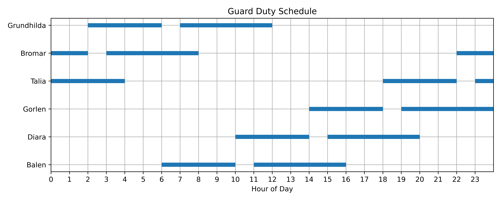
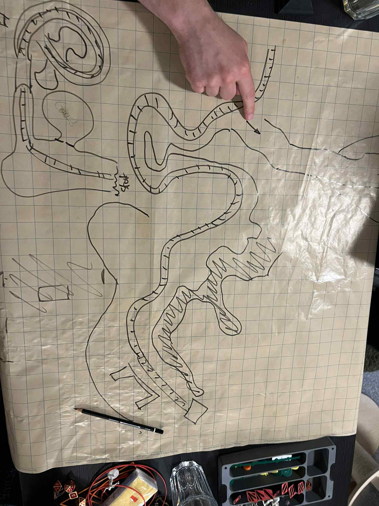

Deal with Fia Glass' competitor in Jernhold.
Kill Silas Braa.

- **Location**: Gildmereholt, Jernhold
- **Reward**: 25,000 gold

*This later turns into saving the kingdom of Vestvold.*

## Details

Silas is defended by six guards
1. **Balin**: In charge of security. Stationed during daytime, less attentive later on in the day. Heavily armored, not easily scared. Huge and brutal. Uses a great sword. Do not let him move - known as a galloping bull. Human.
1. **Diara**: Head of intelligence, incl. leading a spy network. Very resistant against charm. Very perceptive and evasive. Human.
1. **Gorlan**: Engineer, in charge of traps. Less intimidating in a fight than the other guards when not on home turf, but **do not** fight him in hiw own element. Red thiefling.
1. **Talia**: Poison resistant, very resistant against hits. Uses longsword. Halforc
1. **Bromar**: Wizard, not armored. Omega-powerful, **allegedly** more powerful than Valgroth (surely cannot be). Dwarf, but larger than a hyman in size.
1. **Grundhilda**: Ranger. Carries magical bow. Dwarf.

### Guard schedule

| Hour | Balen | Diara | Gorlen | Talia | Bromar | Grundhilda |
|------|:-----:|:-----:|:------:|:-----:|:------:|:----------:|
| 0    |       |       |        |   X   |   X    |            |
| 1    |       |       |        |   X   |   X    |            |
| 2    |       |       |        |   X   |        |     X      |
| 3    |       |       |        |   X   |   X    |     X      |
| 4    |       |       |        |       |   X    |     X      |
| 5    |       |       |        |       |   X    |     X      |
| 6    |   X   |       |        |       |   X    |            |
| 7    |   X   |       |        |       |   X    |     X      |
| 8    |   X   |       |        |       |        |     X      |
| 9    |   X   |       |        |       |        |     X      |
| 10   |       |   X   |        |       |        |     X      |
| 11   |   X   |   X   |        |       |        |     X      |
| 12   |   X   |   X   |        |       |        |            |
| 13   |   X   |   X   |        |       |        |            |
| 14   |   X   |       |   X    |       |        |            |
| 15   |   X   |   X   |   X    |       |        |            |
| 16   |       |   X   |   X    |       |        |            |
| 17   |       |   X   |   X    |       |        |            |
| 18   |       |   X   |        |   X   |        |            |
| 19   |       |   X   |   X    |   X   |        |            |
| 20   |       |       |   X    |   X   |        |            |
| 21   |       |       |   X    |   X   |        |            |
| 22   |       |       |   X    |       |   X    |            |
| 23   |       |       |   X    |   X   |   X    |            |

### After setback

With Bromar & Talia dead, our adventurers are forced to flee from Gildmereholt.
Noticing that Rawager is clearly tracked by magic, Urth and Valgroth splits to find a new safe inn, locating to **Rævens Hvile**, which is near **Den Gyldne Krage**.

As Grundhilda tracks down Rawager & Conrad, Renato comes to the rescue, and they manage to apprehend Grundhilda, who is later hired to be on our side (under a Zone of Truth).
During us questioning her, we learn Silas has been moved to **Eastern Mine**, which has one entry (Grundhilda draws a map for us).
Further, **Helvedes Hunde** has been called as back-up.
New plan is to infiltrate the mine and finish the job.

### Why did Grundhilda change allegiance?

Promised her 1,300 gold and promised to introduce her to **Fia Glass**.

### Assault on the Eastern Mine

Managed to take out Balen, Diara, and Gorlan (and some random guards), and after a chase also Silas.
Found and freed Loken.
Barricaded us below for a long rest, next day plan to escape.
Stealth did not work, and Helvedes Hunde guards found us, but we manages to take them out, including two alphas (strongest guys aside from local leaders, mostly present in Skalara).

Called Fia Glass afterwards, but there is trouble with payment:
Thyra has taken control over Fia's funds, and thus we cannot be paid.
Plan is now akin to a bank heist - breaking into vault to steal the 25,000 gold to act as out payment.
Convinced Fia to help us with this -- on the condition that she can get the killing blow on Thyra.

### Travels to Møllehavn

After being teleported to Talindra upon reaching the agreement with [Alythor Varnix](https://github.com/TorbenSDJohansen/dnd/blob/main/quests/devil/desc.md), we choose to get a boat and sail north to Møllehavn to meet up with Fia Glass and join the rebellion against Thyra (rather then going to [Yloria to chase Dimensionssøgerne, which would have been better...](https://github.com/TorbenSDJohansen/dnd/blob/main/quests/hat/desc.md)).
During our travels north, we encounter a pirate ship which assaults us, looking first as Blodens Brise, the ship of infamous pirate [**name**?].
However, this turns out to be a Beholder (rather fortunate for us), and after chasing it off and taking over Blodens Brise, we continue towards Møllehavn.
Nearing it, we anchor at an island and leave the ship behind, hoping to get back to it at some point.
We meet up with Thyra and go to Møllehavn.

### Assault on Stormhavn

Meeting up with the rebellion at Møllehavn, we plan to strike Stormhavn the next day.
A large, distracting force will assault the southern gates while a strike-force consisting of us and Fia, Rasmus (paladin), Dara (rogue), Morsak (barbarian), Mira (cleric), Thorn (fighter), and some ranger whose name I cannot recall (let's call this lore now) sneaks in through the severs near the Eastern gate.
Making our way to the palace, we find Thyra at the roof and fight her.
We manage to successfully defeat her, with Fia landing the killing blow.

Afterwards, our companions teleport to assist the main assault while we search the palace for the king.
Unable to find him in any room, we search the barracks (where the cells are).

### Reward when?!

In the back of the barracks we find a cell with a bed, but no one there.
Upon investigating the bed, it turns out to be an illusion, and underneath it is a hidden staircase.
Total silence upon descending, meaning no spellcasting.
Down there, we finally find the king shackled and release him.
We then make our way (with the king) to Fia's HQ near the harbor.
The king is hesitant upon hearing we work for Fia, but after learning of her role in the resistance against Thyra, he seems to change his opinion of her.

After waiting barricaded at Fia's HQ (being unsure of possibility of attack), Fia joins us and we receive our award of 25,000 gold, which we store in Conrad's bag.

### Restoring the King

We now make our way towards the palace with the King, afraid of more hidden dragonkin (*this is also where Urth's vampire arch start*).
We are stuck in a tough situation, not knowing who to trust.
The king suggest we search for **Malor**, a trusted, high-rank guard.
On the way from the palace to the market place top find him, we further find **Rasmus** (palading) again.
Returning to the palace, we examine guards one by one with Urth's detect magic to find any more dragonkin.
We learn they are hidden through the use of magical rings (like ours).
