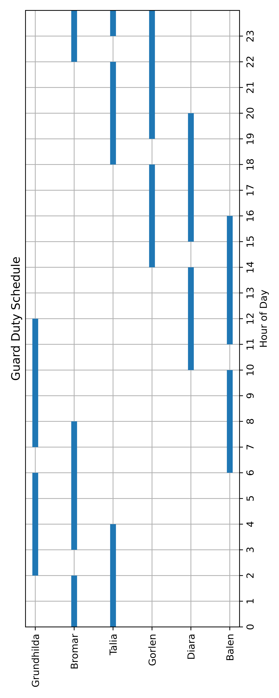

Deal with Fia Glass' competitor in Jernhold.
Kill Silas Braa.

- **Location**: Gildmereholt, Jernhold
- **Reward**: 25,000 gold

## Details

Silas is defended by six guards
1. **Balin**: In charge of security. Stationed during daytime, less attentive later on in the day. Heavily armored, not easily scared. Huge and brutal. Uses a great sword. Do not let him move - known as a galloping bull. Human.
1. **Diara**: Head of intelligence, incl. leading a spy network. Very resistant against charm. Very perceptive and evasive. Human.
1. **Gorlan**: Engineer, in charge of traps. Less intimidating in a fight than the other guards when not on home turf, but **do not** fight him in hiw own element. Red thiefling.
1. **Talia**: Poison resistant, very resistant against hits. Uses longsword. Halforc
1. **Bromar**: Wizard, not armored. Omega-powerful, **allegedly** more powerful than Valgroth (surely cannot be). Dwarf, but larger than a hyman in size.
1. **Grundhilda**: Ranger. Carries magical bow. Dwarf.

### Guard schedule

| Hour | Balen | Diara | Gorlen | Talia | Bromar | Grundhilda |
|------|:-----:|:-----:|:------:|:-----:|:------:|:----------:|
| 0    |       |       |        |   X   |   X    |            |
| 1    |       |       |        |   X   |   X    |            |
| 2    |       |       |        |   X   |        |     X      |
| 3    |       |       |        |   X   |   X    |     X      |
| 4    |       |       |        |       |   X    |     X      |
| 5    |       |       |        |       |   X    |     X      |
| 6    |   X   |       |        |       |   X    |            |
| 7    |   X   |       |        |       |   X    |     X      |
| 8    |   X   |       |        |       |        |     X      |
| 9    |   X   |       |        |       |        |     X      |
| 10   |       |   X   |        |       |        |     X      |
| 11   |   X   |   X   |        |       |        |     X      |
| 12   |   X   |   X   |        |       |        |            |
| 13   |   X   |   X   |        |       |        |            |
| 14   |   X   |       |   X    |       |        |            |
| 15   |   X   |   X   |   X    |       |        |            |
| 16   |       |   X   |   X    |       |        |            |
| 17   |       |   X   |   X    |       |        |            |
| 18   |       |   X   |        |   X   |        |            |
| 19   |       |   X   |   X    |   X   |        |            |
| 20   |       |       |   X    |   X   |        |            |
| 21   |       |       |   X    |   X   |        |            |
| 22   |       |       |   X    |       |   X    |            |
| 23   |       |       |   X    |   X   |   X    |            |

### After setback

With Bromar & Talia dead, our adventurers are forced to flee from Gildmereholt.
Noticing that Rawager is clearly tracked by magic, Urth and Valgroth splits to find a new safe inn, locating to **Rævens Hvile**, which is near **Den Gyldne Krage**.

As Grundhilda tracks down Rawager & Conrad, Renato comes to the rescue, and they manage to apprehend Grundhilda, who is later hired to be on our side (under a Zone of Truth).
During us questioning her, we learn Silas has been moved to **Eastern Mine**, which has one entry (Grundhilda draws a map for us).
Further, **Helvedes Hunde** has been called as back-up.
New plan is to infiltrate the mine and finish the job.

### Why did Grundhilda change allegiance?

Promised her 1,300 gold and promised to introduce her to **Fia Glass**.

### Assault on the Eastern Mine

